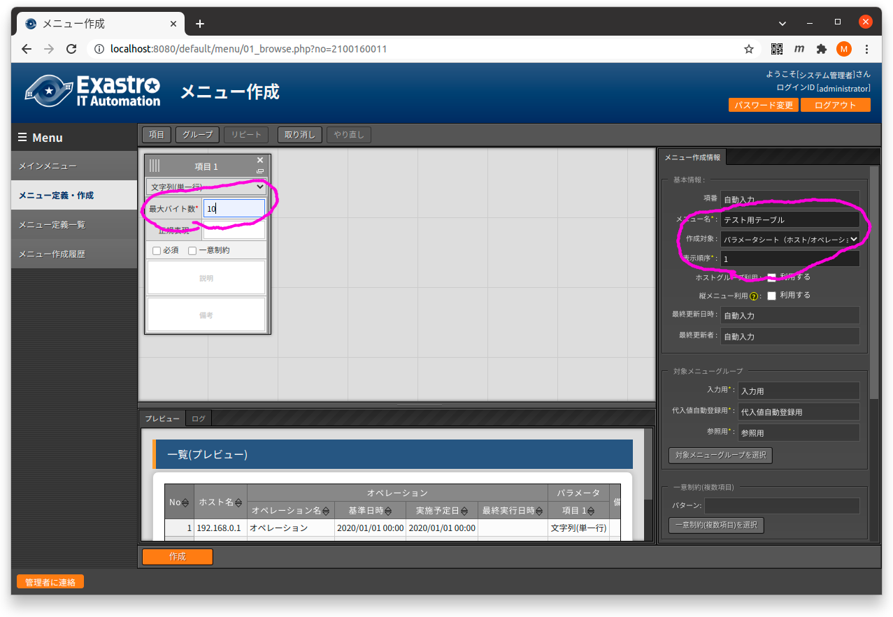
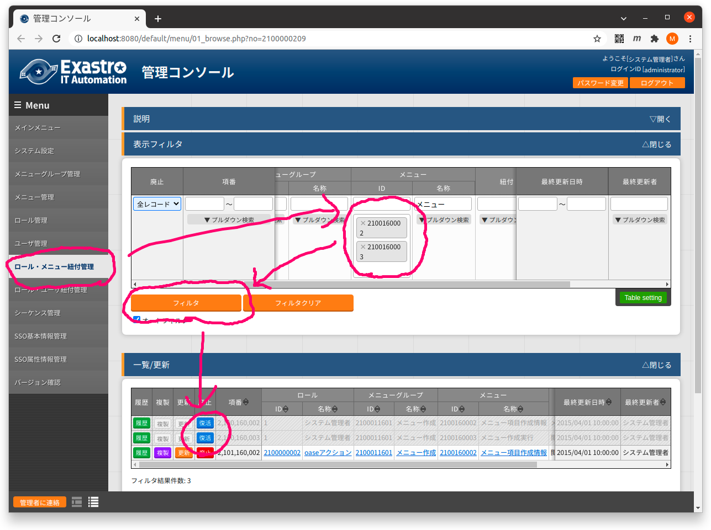
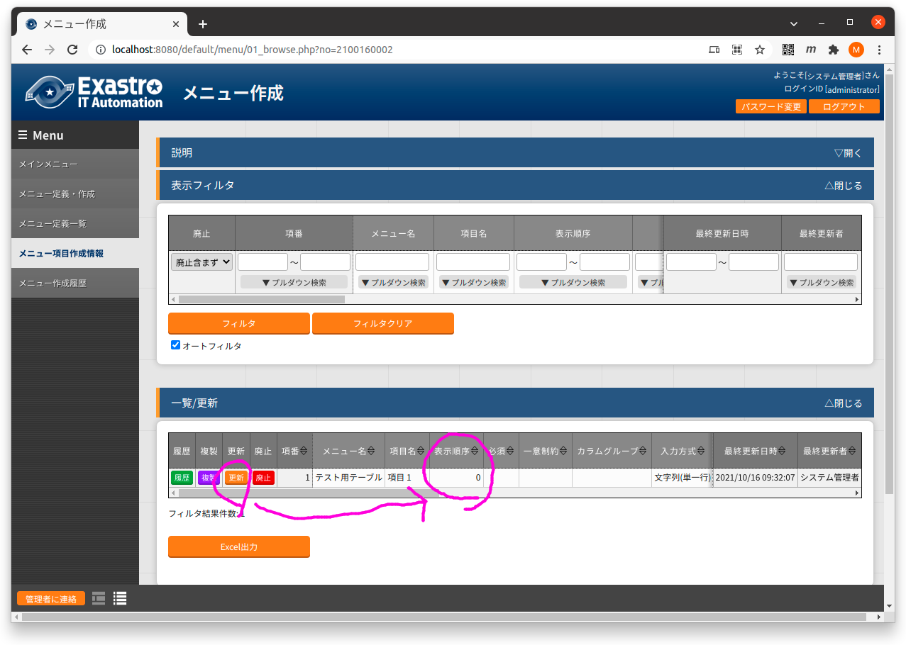

# 一旦手作業でメニューを作成

現状(v1.8.1)では、メニューを作成するREST APIは存在しないので、メニューを手動で作成した後、REST APIでメニュー項目を追加し、そしてメニューを再作成することで、望むメニューを作成する。

## 「メニュー定義・作成」でメニューを作成する

画面「メニュー定義・作成」にアクセスする。

  * http://localhost:8080/default/menu/01_browse.php?no=2100160011

以下のスクリーンショットのようにして、メニューを作成する。
必要な入力項目が、画像中に丸で囲んだ部分であり、以下の値を入力する。

| 入力項目     | 入力内容         | 備考                                                     |
| ------------ | ---------------- | -------------------------------------------------------- |
| メニュー名   | テスト用テーブル | メニュー項目作成などでメニュー名を合わせれば何でもよい   |
| 表示順序     |                1 | もし他に既にメニューがあるなら、値は適当に調整する       |
| 最大バイト数 |               10 | 入力必須なので入力しているが、使わないので値は何でもよい |

## 「メニュー作成に関わるメニューを復活

画面「ロール・メニュー紐付管理」にアクセスする。

  * http://localhost:8080/default/menu/01_browse.php?no=2100000209

以下のスクリーンショットのように、メニューIDに`2100160002`および`2100160003`を指定してボタン「フィルタ」を押下し、表示されたレコードでボタン「復活」を押下する。

# メニュー項目の表示順を変更

画面「メニュー項目作成情報」にアクセスする。

  * http://localhost:8080/default/menu/01_browse.php?no=2100160002

ボタン「フィルタ」を押下して、先ほど作成したメニュー項目を表示させる。
そして、そのメニュー項目についてボタン「更新」を押下し、表示順序にREST APIで追加するメニュー項目と衝突しないような、大きな値(99など)を入れておく。
なお、最初に作成したメニュー項目は削除してもよいかもしれないが、試していない。

